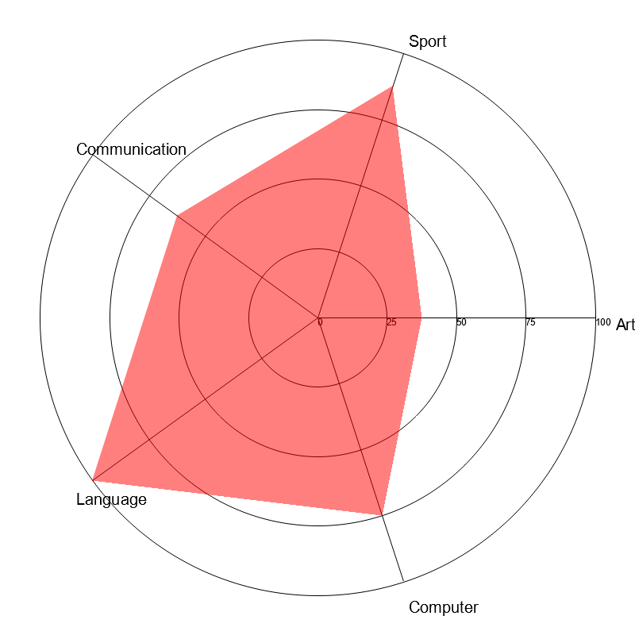

# Chart_Generator 📊
by Parin Vessakosol 66011123 <br>
King Mongkut's Institute of Technology Ladkrabang


## Introduction
The Chart_Generator is a command-line application written in Rust, which allows users to generate different types of charts from CSV data. The user can choose from various chart types like Bar Chart, Scatter Plot, Pie Chart, Line and Area Chart, and Radar Chart.
The program takes in user input to select the desired chart type, the location of the CSV files, output filenames, and chart titles. After processing the data, it generates a visual representation of the data in the form of a chart and saves it as a PNG or SVG file.
The user-friendly prompts guide users in making the correct choices and ensure they provide the necessary inputs for each chart type. If any error occurs during the data loading or plotting phase, the program handles it gracefully and informs the user.

## Features
   
   - Multiple Chart Options: Users can generate Bar Chart, Scatter Plot, Pie Chart, Line and Area Chart, and Radar Chart.

   - Interactive User Prompts: The application provides interactive prompts for the user to make the required choices and inputs.

   - Error Handling: The program includes robust error handling to guide users in case of incorrect input or issues in data processing.

   - File Validation: Before processing, the application validates the input file names and ensures they meet the necessary criteria.

   - Customizable Output: Users can specify custom output file names and chart titles to tailor the visualizations to their needs.

```shell
Choose the type of chart you want to generate:
1. Bar Chart (Expected Columns: 'Category', 'Value')
2. Scatter Plot (Expected Columns for two CSVs: 'X1', 'Y1' and 'X2', 'Y2')
3. Pie Chart (Expected Columns: 'Category', 'Percentage')
4. Line and Area Chart (Expected Columns: 'Date', 'Value')
5. Radar Chart (Expected Columns: 'Label', 'Value')
'q' or 'quit' to quit program.
Enter your choice (1-5, q to quit):
```

___

#### 1. Bar Chart
```shell
Enter your choice (1-5, q to quit):
1
```
```shell
Enter the name of the CSV file (e.g., 'data.csv'):
car_chart.csv
```
```shell
Enter the desired name for the PNG output file (.g., 'output.png'):
Bar_chart.png
```
```shell
Enter the title for the chart:
Age
```


This feature allows users to:
 * Visualize categorical data with rectangular bars
 * Compare different categories based on their values

Input Expected: CSV with columns 'Category' and 'Value'.
___

#### 2. Scatter Plot

```shell
Enter your choice (1-5, q to quit):
2
```
```shell
Enter the name of the first CSV file for scatter plot (e.g., 'data1.csv'):
data1.csv
```
```shell
Enter the name of the first CSV file for scatter plot (e.g., 'data2.csv'):
data2.csv
```
```shell
Enter the desired name for the PNG output file (e.g., 'output.png'):
Scatter.png
```
```shell
Enter the title for the chart:
Scatter x,y
```


This feature displays:
 * Data points on a two-dimensional axis
 * Relationships between two variables from two separate CSVs

Input Expected: Two CSVs with columns 'X1', 'Y1' and 'X2', 'Y2' respectively.
___

#### 3. Pie Chart

```shell
Enter your choice (1-5, q to quit):
3
```
```shell
Enter the name of the CSV file (e.g., 'data.csv'):
data_pie.csv
```
```shell
Enter the desired name for the PNG output file (e.g., 'output.png'):
Pie.png
```
```shell
Enter the title for the chart:
Regions Sales Percentage
```


This visualization showcases:
 * Proportional representation of categories
 * Circular statistical graphic split into slices

Input Expected: CSV with columns 'Category' and 'Percentage'.
___

#### 4. Line and Area Chart

```shell
Enter the name of the CSV file (e.g., 'data.csv'):
4
```
```shell
Enter the name of the CSV file (e.g., 'data.csv'):
data_line_area.csv
```
```shell
Enter the desired name for the PNG output file (e.g., 'output.png'):
Line_area.png
```
```shell
Enter the title for the chart:
Monthly Sales
```


This chart is optimal for:
  * Displaying information as a series of data points
  * Understanding trends over intervals or time

Input Expected: CSV with columns 'Date' and 'Value'.
___

#### 5. Radar Chart

```shell
Enter your choice (1-5, q to quit):
5
```
```shell
Enter the name of the CSV file for radar chart (e.g., 'radar_data.csv'):
data_radar.csv
```
```shell
Enter the desired name for the SVG output file (e.g., 'radar_chart.png'):
Radar.png 
```



This feature displays:
 * A multi-variable data set on a two-dimensional plane
 * Comparative analysis across different categories

Input Expected: CSV with columns 'Label' and 'Value'.
___

Interactive User Interface

This interface is designed to be user-friendly, guiding users through the entire process of chart generation. From selecting the chart type to entering the desired output filename, every step is made simple.
___

Output Previews

Upon successful generation:
 * Preview the chart output
 * Save it locally in PNG format

___

Error Handling
```shell
Enter your choice (1-5, q to quit):
as 
Invalid choice! Please enter a number between 1 and 5.
```
```shell
Enter your choice (1-5, q to quit):
as 
Invalid choice! Please enter a number between 1 and 5.
```
```shell
Enter the desired name for the PNG output file (.g., 'output.png'):
Outputttt.asd
Invalid filename. Please ensure the filename ends with .png
```
```shell
//if CSV can't read
Error loading CSV file: The system cannot find the file specified. (os error 2)
```
```shell
Enter the desired name for the PNG output file (.g., 'output.png'):
Bar_chart3.png
The file 'Bar_chart3.png' already exists. Please provide a different name.
```
The application is built to handle:
 * Incorrect file names or paths
 * Unsupported data format in CSVs
 * Any other potential errors during the visualization process

Ensuring a smooth user experience throughout.

___

For those looking to bring their data to life, Chart_Generator is the perfect tool, bridging the gap between raw data and insightful visualizations.
